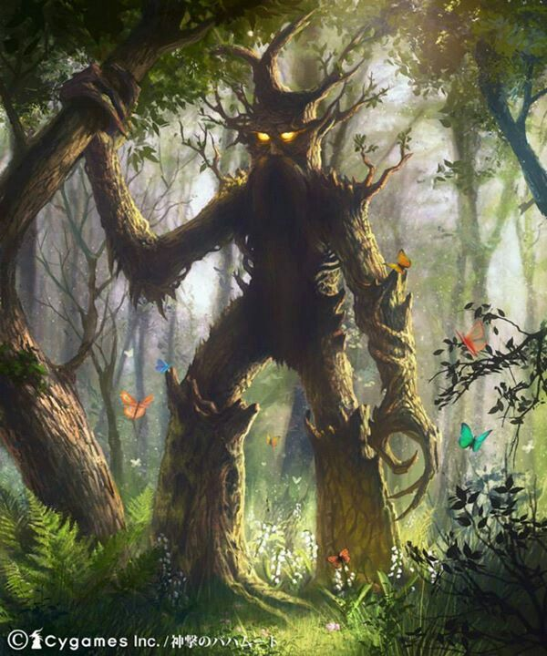

.. Eryn documentation master file, created by
   sphinx-quickstart on Thu Jul 22 20:03:11 2021.
   You can adapt this file completely to your liking, but it should at least
   contain the root `toctree` directive.

Welcome to Eryn's documentation!
================================

.. include:: readme.md
   :parser: myst_parser.sphinx_

.. toctree::
   :maxdepth: 4
   :caption: Documentation:

   user/ensemble
   user/state
   user/backend
   user/moves
   user/prior
   user/temper
   user/utils

.. toctree::
  :maxdepth: 4
  :caption: Tutorial:

  tutorial/Eryn_tutorial
  tutorial/more_tutorials

.. toctree::
  :maxdepth: 4
  :caption: General Information:
  
  general/todos
